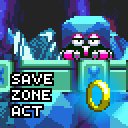

# Save Zone Act

Save the second act of the zone after closing the game. Do not deny yourself the pleasure of closing the game during the second act, making a tea, and enjoying the evening watching a movie.

## List of features:

* Automatically saves the act of the current zone after the zone card of the first act.

* Saves your score, lifes and continues at the end of the first act.

* Choosing an act for completed slots inside Data Select menu.

* Does not save any data for the "No Save" slot and the game via Act/Level select.

## Compatibility notes:

Not compatible with <a href="https://gamebanana.com/wips/51390 ">Sonic 3 Encore</a> now. Expect this after the full release of Sonic 3 Encore.

1. <a href="https://gamebanana.com/mods/334378">Sonic 3 Complete Font</a>, <a href="https://gamebanana.com/mods/361615">Sonic 3 Complete Sound Test</a> can be set in any order of priority.

2. <a href="https://gamebanana.com/mods/54063">Original zone order</a>, <a href="https://gamebanana.com/mods/323556">Mania Style Data Select</a>, <a href="https://gamebanana.com/mods/336038">Extra Slot Mighty</a> must be installed below this mod.

## FAQ:

Q. According to what scenario is the zone act saved, and how to load it after exiting from game?  
A. The mod saves the current zone act after the zone card of the first act. After exiting the game, and when trying to enter one of the slots, the last save of the act of the slot zone will be loaded.

Q. My save was broken - it loading a wrong zone/act. What should I do?  
A. Make sure to update the mod to the latest version. Enter to the save slots, the bug-correctionscript will try to fix this. If you still encounter this, then delete the saved slot act. Simply press [UP] during [YES/NO] on the Eggman sign.

Q. I noticed a bug, where can I contact?  
A. Contact me in the comments of Gamebanana, GitHub issues, or via Discord on the Sonic 3 A.I.R modding server. Try to describe the problem in more detail.